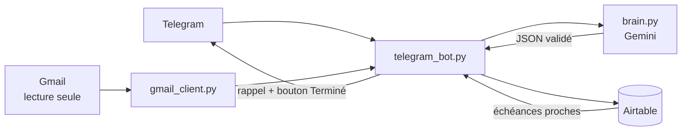

# 🤖 AI Personal Assistant

Un assistant personnel qui **capte mes messages Telegram et mes emails Gmail**, en extrait les tâches, rappels et informations utiles grâce à l'IA, **les range dans Airtable** et **me prévient sur Telegram** avant les échéances.


## Pourquoi ce projet ?

Messages, emails, rappels : les demandes arrivent partout et se perdent. Cet assistant centralise le tout en un seul endroit, sans jongler entre les applications : j'écris ou je reçois un message, et il devient une tâche datée, classée par priorité, avec un rappel automatique.

## Fonctionnalités

- 💬 **Capture par Telegram** : j'écris en langage naturel (« Rappelle-moi d'envoyer le rapport vendredi avant 17h »), le bot comprend et enregistre.
- 📧 **Lecture des emails Gmail** (lecture seule) : les emails qui demandent une action sont extraits ; publicités et notifications automatiques sont écartées.
- 🧠 **Analyse par IA** : chaque message est classé en *tâche*, *rappel* ou *info*, avec un titre court, une échéance (dates relatives résolues) et une priorité.
- 🗂️ **Rangement dans Airtable** : une base unique, filtrable et triable.
- ⏰ **Rappels Telegram** : un message avant l'échéance, avec un bouton **✅ Terminé** qui met à jour Airtable.
- 🔒 **Bot privé** : il ne répond qu'à mon identifiant Telegram.

## Exemple

Message envoyé au bot :

> Rappelle-moi d'envoyer le rapport BSC à Mme Laurent vendredi avant 17h

Résultat produit par l'IA :

```json
{
  "type": "rappel",
  "titre": "Envoyer le rapport BSC à Mme Laurent",
  "echeance": "2026-10-02T17:00",
  "priorite": "moyenne",
  "resume": "Envoi du rapport BSC à Mme Laurent à effectuer avant vendredi 17h.",
  "source": "telegram"
}
```

Une ligne est créée dans Airtable, le bot confirme dans Telegram, puis envoie un rappel avant l'échéance.

<!--
Ajoute ici tes captures (sans token, sans identifiant de base, sans données personnelles) :


-->

## Architecture



| Module | Rôle |
|---|---|
| `app/brain.py` | Appel à Gemini, sortie JSON validée côté code, nouvelles tentatives et modèles de secours si l'API est saturée |
| `app/airtable_store.py` | Écriture et lecture des éléments dans Airtable (API REST) |
| `app/telegram_bot.py` | Bot Telegram, planificateur de rappels, lecture périodique des emails |
| `app/gmail_client.py` | Accès Gmail en lecture seule (OAuth), extraction du texte des emails |
| `test_flow.py` | Test du cerveau seul, puis du flux complet vers Airtable |

## Choix de conception

- **Lecture seule sur Gmail** : l'assistant ne peut ni envoyer, ni supprimer, ni modifier un email.
- **Le contenu des messages est traité comme une donnée**, jamais comme une instruction : un email malveillant ne peut pas piloter le modèle.
- **Sortie du modèle jamais crue sur parole** : type et priorité sont validés avant toute écriture.
- **Résilience** : délais d'attente, nouvelles tentatives et modèles de secours quand l'API IA est saturée (erreurs 429 et 503).
- **Pas de doublons** : un rappel n'est envoyé qu'une fois (case cochée dans Airtable), un email n'est analysé qu'une fois.
- **Fuseau horaire explicite** (Europe/Paris), indépendant de celui du serveur.
- **Secrets hors du code** : tout passe par des variables d'environnement.

## Stack technique

Python · Google Gemini (`google-genai`) · Airtable (API REST) · python-telegram-bot (avec JobQueue) · Gmail API (OAuth)

## Installation

### 1. Prérequis

- Python 3.11 ou plus
- Une clé API Gemini ([Google AI Studio](https://aistudio.google.com/apikey))
- Une base Airtable et un token d'accès personnel (scopes `data.records:read` et `data.records:write`)
- Un bot Telegram créé avec [@BotFather](https://t.me/BotFather)
- (Optionnel) Un projet Google Cloud avec l'API Gmail activée, pour la lecture des emails

### 2. Table Airtable

Crée une table **Tâches** avec exactement ces champs (accents compris) :

| Champ | Type |
|---|---|
| Titre | Texte sur une ligne |
| Type | Sélection unique : Tâche, Rappel, Info |
| Priorité | Sélection unique : Haute, Moyenne, Basse |
| Source | Sélection unique : Telegram, Gmail |
| Statut | Sélection unique : À faire, En cours, Terminé |
| Échéance | Date avec heure (24 h), fuseau horaire fixe |
| Notes | Texte long |
| Rappel envoyé | Case à cocher |

### 3. Configuration

```bash
python -m venv .venv
.venv\Scripts\activate            # Windows (Linux/Mac : source .venv/bin/activate)
pip install -r requirements.txt
cp env.example .env               # Windows : copy env.example .env
```

Remplis le fichier `.env` :

| Variable | Description |
|---|---|
| `GEMINI_API_KEY` | Clé API Gemini |
| `GEMINI_MODEL` | Modèle principal (ex. `gemini-3.8-flash`) |
| `GEMINI_FALLBACK_MODELS` | Modèles de secours, séparés par des virgules |
| `AIRTABLE_TOKEN` | Token d'accès personnel Airtable |
| `AIRTABLE_BASE_ID` | Identifiant de la base (commence par `app`) |
| `AIRTABLE_TABLE` | Nom de la table (`Tâches`) |
| `TELEGRAM_BOT_TOKEN` | Token donné par BotFather |
| `TELEGRAM_ALLOWED_USER_ID` | Ton identifiant Telegram (commande `/id` du bot) |
| `REMINDER_LEAD_MINUTES` | Prévenir X minutes avant l'échéance (30 par défaut) |
| `GMAIL_QUERY` | Filtre des emails à analyser |
| `EMAIL_CHECK_SECONDS` | Fréquence de lecture des emails (600 par défaut) |
| `TIMEZONE` | Fuseau horaire (`Europe/Paris` par défaut) |

### 4. Lancement

```bash
python test_flow.py --save        # test : message -> IA -> Airtable
python -m app.gmail_client        # autorisation Gmail (une seule fois, optionnel)
python -m app.telegram_bot        # lance le bot
```

Envoie `/start` au bot pour obtenir ton identifiant Telegram, renseigne-le dans `TELEGRAM_ALLOWED_USER_ID`, puis relance.

## Limites actuelles

- Le bot tourne en local : les rappels ne partent que lorsqu'il est lancé (pas de déploiement sur un serveur pour l'instant).
- Les emails déjà traités sont mémorisés dans un fichier local.

## Sécurité

- `.env`, `credentials.json`, `token.json` et `data/` ne doivent **jamais** être publiés : ils sont exclus par `.gitignore`.
- Ne publie pas de capture d'écran montrant un token, une URL d'autorisation Google ou un identifiant de base.
- Si une clé a été exposée, régénère-la immédiatement : supprimer le fichier d'un commit ne l'efface pas de l'historique Git.
- L'offre gratuite de Gemini peut utiliser les données envoyées pour améliorer les produits de Google : à prendre en compte pour les emails sensibles (restreins `GMAIL_QUERY`).

## Pistes d'amélioration

- Déploiement sur un serveur pour que les rappels partent en continu.
- Brouillons de réponse aux emails (en lecture/écriture limitée aux brouillons, sans jamais envoyer).
- Résumé quotidien des tâches du jour envoyé sur Telegram.
- Commandes Telegram (`/taches`, `/aujourdhui`) pour consulter la liste sans ouvrir Airtable.
- Mémorisation des emails traités dans Airtable plutôt qu'en fichier local.

## Auteure

**Flora**
