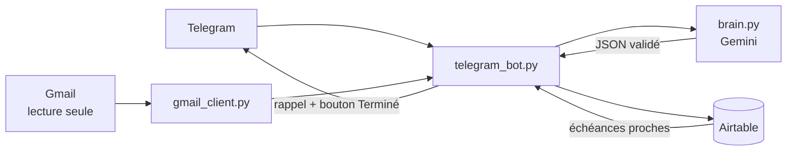

# 🤖 AI Personal Assistant

Un assistant personnel qui **capte mes messages Telegram et mes emails Gmail**, en extrait les tâches, rappels et informations utiles grâce à l'IA, **les range dans Airtable** et **me prévient sur Telegram** avant les échéances.


<?xml version="1.0" encoding="UTF-8"?>
<svg xmlns="http://www.w3.org/2000/svg" viewBox="0 0 960 540" width="960" height="540" font-family="Segoe UI, Helvetica, Arial, sans-serif" xmlns:c2pa="http://c2pa.org/manifest"><metadata><c2pa:manifest>AAAWgmp1bWIAAAAeanVtZGMycGEAEQAQgAAAqgA4m3EDYzJwYQAAABZcanVtYgAAAEdqdW1kYzJtYQARABCAAACqADibcQN1cm46YzJwYTpkMTU1NTI3ZS00YjVhLTRiMGYtOTAxZi04MDJhZDQ0OGExYTEAAAADl2p1bWIAAAApanVtZGMyYXMAEQAQgAAAqgA4m3EDYzJwYS5hc3NlcnRpb25zAAAAALxqdW1iAAAARGp1bWRjYm9yABEAEIAAAKoAOJtxE2MycGEuaW5ncmVkaWVudC52MwAAAAAYYzJzaAkbDXUaFBJp39h+3cjcCXQAAABwY2JvcqNpZGM6Zm9ybWF0bWltYWdlL3N2Zyt4bWxqaW5zdGFuY2VJRHgseG1wOmlpZDoyZWI4NGE0NC02NjBkLTQxMDEtOTg4OC01ODNmYTZlMGM3ODdscmVsYXRpb25zaGlwaHBhcmVudE9mAAAB4mp1bWIAAABBanVtZGNib3IAEQAQgAAAqgA4m3ETYzJwYS5hY3Rpb25zLnYyAAAAABhjMnNo+xCBGmtIVA8N8DmvYPVgTQAAAZljYm9yomdhY3Rpb25zgqJmYWN0aW9ua2MycGEub3BlbmVkanBhcmFtZXRlcnOha2luZ3JlZGllbnRzgaJjdXJseC1zZWxmI2p1bWJmPWMycGEuYXNzZXJ0aW9ucy9jMnBhLmluZ3JlZGllbnQudjNkaGFzaFggRAr95Gw2uZkOsy3cWsNNQVEgl5Hy2jTwOmI22iDABhGkZmFjdGlvbngdY29tLmFudGhyb3BpYy5jbGF1ZGUucHJvdmlkZWRqcGFyYW1ldGVyc6F4H2NvbS5hbnRocm9waWMub3JpZ2luLWNvbmZpZGVuY2VndW5rbm93bmtkZXNjcmlwdGlvbnhmQ2xhdWRlIHByb3ZpZGVkIHRoaXMgZmlsZSBhdCB0aGUgcmVxdWVzdCBvZiBhIHVzZXIgYW5kIG1heSBoYXZlIGNyZWF0ZWQgb3IgbW9kaWZpZWQgdGhlIGZpbGUgY29udGVudHMubXNvZnR3YXJlQWdlbnShZG5hbWVmQ2xhdWRlcmFsbEFjdGlvbnNJbmNsdWRlZPUAAADIanVtYgAAAEBqdW1kY2JvcgARABCAAACqADibcRNjMnBhLmhhc2guZGF0YQAAAAAYYzJzaAyfPAuV1c3Y//E6I9BIMncAAACAY2JvcqVjYWxnZnNoYTI1NmNwYWRNAAAAAAAAAAAAAAAAAGRoYXNoWCDSuQPi7qB1h6eznkvVgM32sfSjq/gToqq/I7j6pzFrh2RuYW1lbmp1bWJmIG1hbmlmZXN0amV4Y2x1c2lvbnOBomVzdGFydBjyZmxlbmd0aBkeBAAAAj5qdW1iAAAAJ2p1bWRjMmNsABEAEIAAAKoAOJtxA2MycGEuY2xhaW0udjIAAAACD2Nib3KlY2FsZ2ZzaGEyNTZpc2lnbmF0dXJleE1zZWxmI2p1bWJmPS9jMnBhL3VybjpjMnBhOmQxNTU1MjdlLTRiNWEtNGIwZi05MDFmLTgwMmFkNDQ4YTFhMS9jMnBhLnNpZ25hdHVyZWppbnN0YW5jZUlEeCx4bXA6aWlkOmQxZjI0YjgyLWQ0ZTAtNDEyYS04MGYxLWQzM2Y3NWE5ZjU0OXJjcmVhdGVkX2Fzc2VydGlvbnODomN1cmx4LXNlbGYjanVtYmY9YzJwYS5hc3NlcnRpb25zL2MycGEuaW5ncmVkaWVudC52M2RoYXNoWCBECv3kbDa5mQ6zLdxaw01BUSCXkfLaNPA6YjbaIMAGEaJjdXJseCpzZWxmI2p1bWJmPWMycGEuYXNzZXJ0aW9ucy9jMnBhLmFjdGlvbnMudjJkaGFzaFggCjad3EvGBmTpoLUKtqLhhvLN12oZCitXBBkLmQqaJ2+iY3VybHgpc2VsZiNqdW1iZj1jMnBhLmFzc2VydGlvbnMvYzJwYS5oYXNoLmRhdGFkaGFzaFggwoMEcc9GiL5gvugoIo7FDvu44KUD0U+NXEdAXfVULUF0Y2xhaW1fZ2VuZXJhdG9yX2luZm+jZG5hbWVvQW50aHJvcGljIEZpbGVzZ3ZlcnNpb25lMS4wLjBrc3BlY1ZlcnNpb25lMi40LjAAABA4anVtYgAAAChqdW1kYzJjcwARABCAAACqADibcQNjMnBhLnNpZ25hdHVyZQAAABAIY2JvctKEWQISogEmGCFZAgowggIGMIIBjaADAgECAhRA5aAK7sI50L64g/oGQgU9Z1UTADAKBggqhkjOPQQDAzBJMRcwFQYDVQQKEw5BbnRocm9waWMsIFBCQzEuMCwGA1UEAxMlQW50aHJvcGljIENvbnRlbnQgQ3JlZGVudGlhbHMgUm9vdCBDQTAeFw0yNjA4MDcxODQzNTZaFw0yODA4MDYxOTQzNTZaMEQxFzAVBgNVBAoTDkFudGhyb3BpYywgUEJDMSkwJwYDVQQDEyBBbnRocm9waWMgQ2xhdWRlIENvbnRlbnQgU2lnbmluZzBZMBMGByqGSM49AgEGCCqGSM49AwEHA0IABJh6CmvLUBgFFNU0vUKlOVtE6djd17L5SuwX0LemFisBM3dkd/3cyjxFA3Qo5S46fX0/ihY0VZ7mfb9KF703t5OjWDBWMA4GA1UdDwEB/wQEAwIHgDAVBgNVHSUEDjAMBgorBgEEAYPoXgIBMAwGA1UdEwEB/wQCMAAwHwYDVR0jBBgwFoAUzlHiBIFOZFsj+OPEz5o+nMHXXMIwCgYIKoZIzj0EAwMDZwAwZAIwMXMdFJ4BetLLVY7ORuE9noqbbAZOZn/aArXyTwFAZfKrPzxF2vPoJNf1+UCdg1XGAjBwX1zd9WGqYkqmL5SFqw1QySjr1zJfpJM9+1rdDwSPLMOPOjKuiXjoU/pUUeG9RwmhY3BhZFkNngAAAAAAAAAAAAAAAAAAAAAAAAAAAAAAAAAAAAAAAAAAAAAAAAAAAAAAAAAAAAAAAAAAAAAAAAAAAAAAAAAAAAAAAAAAAAAAAAAAAAAAAAAAAAAAAAAAAAAAAAAAAAAAAAAAAAAAAAAAAAAAAAAAAAAAAAAAAAAAAAAAAAAAAAAAAAAAAAAAAAAAAAAAAAAAAAAAAAAAAAAAAAAAAAAAAAAAAAAAAAAAAAAAAAAAAAAAAAAAAAAAAAAAAAAAAAAAAAAAAAAAAAAAAAAAAAAAAAAAAAAAAAAAAAAAAAAAAAAAAAAAAAAAAAAAAAAAAAAAAAAAAAAAAAAAAAAAAAAAAAAAAAAAAAAAAAAAAAAAAAAAAAAAAAAAAAAAAAAAAAAAAAAAAAAAAAAAAAAAAAAAAAAAAAAAAAAAAAAAAAAAAAAAAAAAAAAAAAAAAAAAAAAAAAAAAAAAAAAAAAAAAAAAAAAAAAAAAAAAAAAAAAAAAAAAAAAAAAAAAAAAAAAAAAAAAAAAAAAAAAAAAAAAAAAAAAAAAAAAAAAAAAAAAAAAAAAAAAAAAAAAAAAAAAAAAAAAAAAAAAAAAAAAAAAAAAAAAAAAAAAAAAAAAAAAAAAAAAAAAAAAAAAAAAAAAAAAAAAAAAAAAAAAAAAAAAAAAAAAAAAAAAAAAAAAAAAAAAAAAAAAAAAAAAAAAAAAAAAAAAAAAAAAAAAAAAAAAAAAAAAAAAAAAAAAAAAAAAAAAAAAAAAAAAAAAAAAAAAAAAAAAAAAAAAAAAAAAAAAAAAAAAAAAAAAAAAAAAAAAAAAAAAAAAAAAAAAAAAAAAAAAAAAAAAAAAAAAAAAAAAAAAAAAAAAAAAAAAAAAAAAAAAAAAAAAAAAAAAAAAAAAAAAAAAAAAAAAAAAAAAAAAAAAAAAAAAAAAAAAAAAAAAAAAAAAAAAAAAAAAAAAAAAAAAAAAAAAAAAAAAAAAAAAAAAAAAAAAAAAAAAAAAAAAAAAAAAAAAAAAAAAAAAAAAAAAAAAAAAAAAAAAAAAAAAAAAAAAAAAAAAAAAAAAAAAAAAAAAAAAAAAAAAAAAAAAAAAAAAAAAAAAAAAAAAAAAAAAAAAAAAAAAAAAAAAAAAAAAAAAAAAAAAAAAAAAAAAAAAAAAAAAAAAAAAAAAAAAAAAAAAAAAAAAAAAAAAAAAAAAAAAAAAAAAAAAAAAAAAAAAAAAAAAAAAAAAAAAAAAAAAAAAAAAAAAAAAAAAAAAAAAAAAAAAAAAAAAAAAAAAAAAAAAAAAAAAAAAAAAAAAAAAAAAAAAAAAAAAAAAAAAAAAAAAAAAAAAAAAAAAAAAAAAAAAAAAAAAAAAAAAAAAAAAAAAAAAAAAAAAAAAAAAAAAAAAAAAAAAAAAAAAAAAAAAAAAAAAAAAAAAAAAAAAAAAAAAAAAAAAAAAAAAAAAAAAAAAAAAAAAAAAAAAAAAAAAAAAAAAAAAAAAAAAAAAAAAAAAAAAAAAAAAAAAAAAAAAAAAAAAAAAAAAAAAAAAAAAAAAAAAAAAAAAAAAAAAAAAAAAAAAAAAAAAAAAAAAAAAAAAAAAAAAAAAAAAAAAAAAAAAAAAAAAAAAAAAAAAAAAAAAAAAAAAAAAAAAAAAAAAAAAAAAAAAAAAAAAAAAAAAAAAAAAAAAAAAAAAAAAAAAAAAAAAAAAAAAAAAAAAAAAAAAAAAAAAAAAAAAAAAAAAAAAAAAAAAAAAAAAAAAAAAAAAAAAAAAAAAAAAAAAAAAAAAAAAAAAAAAAAAAAAAAAAAAAAAAAAAAAAAAAAAAAAAAAAAAAAAAAAAAAAAAAAAAAAAAAAAAAAAAAAAAAAAAAAAAAAAAAAAAAAAAAAAAAAAAAAAAAAAAAAAAAAAAAAAAAAAAAAAAAAAAAAAAAAAAAAAAAAAAAAAAAAAAAAAAAAAAAAAAAAAAAAAAAAAAAAAAAAAAAAAAAAAAAAAAAAAAAAAAAAAAAAAAAAAAAAAAAAAAAAAAAAAAAAAAAAAAAAAAAAAAAAAAAAAAAAAAAAAAAAAAAAAAAAAAAAAAAAAAAAAAAAAAAAAAAAAAAAAAAAAAAAAAAAAAAAAAAAAAAAAAAAAAAAAAAAAAAAAAAAAAAAAAAAAAAAAAAAAAAAAAAAAAAAAAAAAAAAAAAAAAAAAAAAAAAAAAAAAAAAAAAAAAAAAAAAAAAAAAAAAAAAAAAAAAAAAAAAAAAAAAAAAAAAAAAAAAAAAAAAAAAAAAAAAAAAAAAAAAAAAAAAAAAAAAAAAAAAAAAAAAAAAAAAAAAAAAAAAAAAAAAAAAAAAAAAAAAAAAAAAAAAAAAAAAAAAAAAAAAAAAAAAAAAAAAAAAAAAAAAAAAAAAAAAAAAAAAAAAAAAAAAAAAAAAAAAAAAAAAAAAAAAAAAAAAAAAAAAAAAAAAAAAAAAAAAAAAAAAAAAAAAAAAAAAAAAAAAAAAAAAAAAAAAAAAAAAAAAAAAAAAAAAAAAAAAAAAAAAAAAAAAAAAAAAAAAAAAAAAAAAAAAAAAAAAAAAAAAAAAAAAAAAAAAAAAAAAAAAAAAAAAAAAAAAAAAAAAAAAAAAAAAAAAAAAAAAAAAAAAAAAAAAAAAAAAAAAAAAAAAAAAAAAAAAAAAAAAAAAAAAAAAAAAAAAAAAAAAAAAAAAAAAAAAAAAAAAAAAAAAAAAAAAAAAAAAAAAAAAAAAAAAAAAAAAAAAAAAAAAAAAAAAAAAAAAAAAAAAAAAAAAAAAAAAAAAAAAAAAAAAAAAAAAAAAAAAAAAAAAAAAAAAAAAAAAAAAAAAAAAAAAAAAAAAAAAAAAAAAAAAAAAAAAAAAAAAAAAAAAAAAAAAAAAAAAAAAAAAAAAAAAAAAAAAAAAAAAAAAAAAAAAAAAAAAAAAAAAAAAAAAAAAAAAAAAAAAAAAAAAAAAAAAAAAAAAAAAAAAAAAAAAAAAAAAAAAAAAAAAAAAAAAAAAAAAAAAAAAAAAAAAAAAAAAAAAAAAAAAAAAAAAAAAAAAAAAAAAAAAAAAAAAAAAAAAAAAAAAAAAAAAAAAAAAAAAAAAAAAAAAAAAAAAAAAAAAAAAAAAAAAAAAAAAAAAAAAAAAAAAAAAAAAAAAAAAAAAAAAAAAAAAAAAAAAAAAAAAAAAAAAAAAAAAAAAAAAAAAAAAAAAAAAAAAAAAAAAAAAAAAAAAAAAAAAAAAAAAAAAAAAAAAAAAAAAAAAAAAAAAAAAAAAAAAAAAAAAAAAAAAAAAAAAAAAAAAAAAAAAAAAAAAAAAAAAAAAAAAAAAAAAAAAAAAAAAAAAAAAAAAAAAAAAAAAAAAAAAAAAAAAAAAAAAAAAAAAAAAAAAAAAAAAAAAAAAAAAAAAAAAAAAAAAAAAAAAAAAAAAAAAAAAAAAAAAAAAAAAAAAAAAAAAAAAAAAAAAAAAAAAAAAAAAAAAAAAAAAAAAAAAAAAAAAAAAAAAAAAAAAAAAAAAAAAAAAAAAAAAAAAAAAAAAAAAAAAAAAAAAAAAAAAAAAAAAAAAAAAAAAAAAAAAAAAAAAAAAAAAAAAAAAAAAAAAAAAAAAAAAAAAAAAAAAAAAAAAAAAAAAAAAAAAAAAAAAAAAAAAAAAAAAAAAAAAAAAAAAAAAAAAAAAAAAAAAAAAAAAAAAAAAAAAAAAAAAAAAAAAAAAAAAAAAAAAAAAAAAAAAAAAAAAAAAAAAAAAAAAAAAAAAAAAAAAAAAAAAAAAAAAAAAAAAAAAAAAAAAAAAAAAAAAAAAAAAAAAAAAAAAAAAAAAAAAAAAAAAAAAAAAAAAAAAAAAAAAAAAAAAAAAAAAAAAAAAAAAAAAAAAAAAAAAAAAAAAAAAAAAAAAAAAAAAAAAAAAAAAAAAAAAAAAAAAAAAAAAAAAAAAAAAAAAAAAAAAAAAAAAAAAAAAAAAAAAAAAAAAAAAAAAAAAAAAAAAAAAAAAAAAAAAAAAAAAAAAAAAAAAAAAAAAAAAAAAAAAAAAAAAAAAAAAAAAAAAAAAAAAAAAAAAAAAAAAAAAAAAAAAAAAAAAAAAAAAAAAAAAAAAAAAAAAAAAAAAAAAAAAAAAAAAAAAAAAAAAAAAAAAAAAAAAAAAAAAAAAAAAAAAAAAAAAAAAAAAAAAAAAAAAAAAAAAAAAAAAAAAAAAAAAAAAAAAAAAAAAAAAAAAAAAAAAAAAAAAAAAAAAAAAAAAAAAAAAAAAAAAAAAAAAAAAAAAAAAAAAAAAAAAAAAAAAAAAAAAAAAAAAAAAAAAAAAAAAAAAAAAAAAAAAAAAAAAAAAAAAAAAAAAAAAAAAAAAAAAAAAAAAAAAAAAAAAAAAAAAAAAAAAAAAAAAAAAAAAAAAAAAAAAAAAAAAAAAAAAAAAAAAAAAAAAAAAAAAAAAAAAAAAAAAAAAAAAAAAAAAAAAAAAAAAAAAAAAAAAAAAAAAAAAAAAAAAAAAAAAAAAAAAAAAAAAAAAAAAAAAAAAAAAAAAAAAAAAAAAAAAAAAAAAAAAAAAAAAAAAAAAAAAAAAAAAAAAAAAAAAAAAAAAAAAAAAAAAAAAAAAAAAAAAAAAAAAAAAAAAAAAAAAAAAAAAAAAAAAAAAAAAAAAAAAAAAAAAAAAAAAAAAAAAAAAAAAAAAAAAAAAAAAAAAAAAAAAAAAAAAAAAAAAAAAAAAAAAAAAAAAAAAAAAAPZYQHtdFSddhAfUUpSooQ7t4gG1/fS1DsDpbRxMJbyCHbtu3/nEQOZLfP1rb7XcLIY5HFKz4ax5KmPOV/AnITZ285I=</c2pa:manifest></metadata>
  <defs>
    <marker id="arrow" viewBox="0 0 10 10" refX="8" refY="5" markerWidth="8" markerHeight="8" orient="auto-start-reverse">
      <path d="M0,0 L10,5 L0,10 z" fill="#6B7785"/>
    </marker>
    <filter id="shadow" x="-10%" y="-10%" width="120%" height="130%">
      <feDropShadow dx="0" dy="3" stdDeviation="4" flood-color="#000" flood-opacity="0.10"/>
    </filter>
  </defs>

  <rect width="960" height="540" rx="24" fill="#F7F3EC"/>

  <text x="480" y="62" text-anchor="middle" font-size="40" font-weight="800" fill="#5B8DB8" letter-spacing="1">AI PERSONAL ASSISTANT</text>
  <text x="480" y="94" text-anchor="middle" font-size="17" fill="#4A5560">Telegram + Gmail  →  Gemini  →  Airtable + rappels Telegram</text>

  <text x="170" y="150" text-anchor="middle" font-size="15" font-weight="700" fill="#2B3440">Entrées</text>
  <text x="795" y="150" text-anchor="middle" font-size="15" font-weight="700" fill="#2B3440">Sorties</text>

  <!-- Entrée Telegram -->
  <g filter="url(#shadow)">
    <rect x="60" y="170" width="220" height="112" rx="18" fill="#fff" stroke="#E0D9CC"/>
  </g>
  <circle cx="115" cy="226" r="28" fill="#2AA3E0"/>
  <polygon points="104,226 128,214 122,240 116,232 112,238" fill="#fff"/>
  <text x="160" y="220" font-size="17" font-weight="700" fill="#2B3440">Messages</text>
  <text x="160" y="242" font-size="14" fill="#6B7785">Telegram</text>

  <!-- Entrée Gmail -->
  <g filter="url(#shadow)">
    <rect x="60" y="318" width="220" height="112" rx="18" fill="#fff" stroke="#E0D9CC"/>
  </g>
  <rect x="88" y="344" width="54" height="40" rx="6" fill="#fff" stroke="#D44638" stroke-width="4"/>
  <polyline points="90,348 115,368 140,348" fill="none" stroke="#D44638" stroke-width="4" stroke-linejoin="round"/>
  <text x="160" y="368" font-size="17" font-weight="700" fill="#2B3440">Emails</text>
  <text x="160" y="390" font-size="14" fill="#6B7785">Gmail · lecture seule</text>

  <!-- Assistant -->
  <g filter="url(#shadow)">
    <rect x="370" y="205" width="220" height="190" rx="22" fill="#FFF1E6" stroke="#F0A66A" stroke-width="2"/>
  </g>
  <line x1="480" y1="228" x2="480" y2="240" stroke="#3A4654" stroke-width="3"/>
  <circle cx="480" cy="226" r="5" fill="#F0A66A"/>
  <rect x="436" y="240" width="88" height="66" rx="18" fill="#3A4654"/>
  <circle cx="461" cy="268" r="8" fill="#fff"/>
  <circle cx="499" cy="268" r="8" fill="#fff"/>
  <circle cx="463" cy="269" r="3.5" fill="#3A4654"/>
  <circle cx="501" cy="269" r="3.5" fill="#3A4654"/>
  <path d="M463,288 Q480,300 497,288" fill="none" stroke="#F0A66A" stroke-width="3.5" stroke-linecap="round"/>
  <text x="480" y="341" text-anchor="middle" font-size="19" font-weight="800" fill="#2B3440">AI Assistant</text>
  <text x="480" y="364" text-anchor="middle" font-size="14" fill="#6B7785">Gemini · classe et extrait</text>

  <!-- Flèches entrées -> assistant -->
  <path d="M280,226 C325,226 330,270 366,284" fill="none" stroke="#6B7785" stroke-width="2.5" marker-end="url(#arrow)"/>
  <path d="M280,374 C325,374 330,330 366,316" fill="none" stroke="#6B7785" stroke-width="2.5" marker-end="url(#arrow)"/>

  <!-- Flèches assistant -> sorties -->
  <path d="M590,270 C635,270 640,214 676,214" fill="none" stroke="#6B7785" stroke-width="2.5" marker-end="url(#arrow)"/>
  <path d="M590,300 L676,318" fill="none" stroke="#6B7785" stroke-width="2.5" marker-end="url(#arrow)"/>
  <path d="M590,330 C635,330 640,422 676,422" fill="none" stroke="#6B7785" stroke-width="2.5" marker-end="url(#arrow)"/>

  <!-- Sortie Tâches -->
  <g filter="url(#shadow)">
    <rect x="680" y="170" width="230" height="88" rx="16" fill="#fff" stroke="#E0D9CC"/>
  </g>
  <circle cx="722" cy="214" r="20" fill="none" stroke="#3FA66B" stroke-width="3.5"/>
  <polyline points="713,214 720,222 732,207" fill="none" stroke="#3FA66B" stroke-width="3.5" stroke-linecap="round" stroke-linejoin="round"/>
  <text x="758" y="208" font-size="16" font-weight="700" fill="#2B3440">Tâches</text>
  <text x="758" y="228" font-size="13" fill="#6B7785">Créer et suivre les actions</text>

  <!-- Sortie Rappels -->
  <g filter="url(#shadow)">
    <rect x="680" y="274" width="230" height="88" rx="16" fill="#fff" stroke="#E0D9CC"/>
  </g>
  <path d="M722,298 C709,298 706,312 706,320 L702,330 L742,330 L738,320 C738,312 735,298 722,298 Z" fill="#4C7EF3"/>
  <circle cx="722" cy="336" r="4" fill="#4C7EF3"/>
  <text x="758" y="312" font-size="16" font-weight="700" fill="#2B3440">Rappels</text>
  <text x="758" y="332" font-size="13" fill="#6B7785">Prévenu avant l'échéance</text>

  <!-- Sortie Infos -->
  <g filter="url(#shadow)">
    <rect x="680" y="378" width="230" height="88" rx="16" fill="#fff" stroke="#E0D9CC"/>
  </g>
  <path d="M703,412 L718,412 L723,418 L742,418 L742,438 L703,438 Z" fill="#7B5CD6"/>
  <text x="758" y="416" font-size="16" font-weight="700" fill="#2B3440">Infos organisées</text>
  <text x="758" y="436" font-size="13" fill="#6B7785">Tout rangé dans Airtable</text>

  <text x="480" y="508" text-anchor="middle" font-size="14" fill="#6B7785">Rappel envoyé avant l'échéance · bouton « Terminé » · bot privé · Gmail en lecture seule</text>
</svg>

## Pourquoi ce projet ?

Messages, emails, rappels : les demandes arrivent partout et se perdent. Cet assistant centralise le tout en un seul endroit, sans jongler entre les applications : j'écris ou je reçois un message, et il devient une tâche datée, classée par priorité, avec un rappel automatique.

## Fonctionnalités

- 💬 **Capture par Telegram** : j'écris en langage naturel (« Rappelle-moi d'envoyer le rapport vendredi avant 17h »), le bot comprend et enregistre.
- 📧 **Lecture des emails Gmail** (lecture seule) : les emails qui demandent une action sont extraits ; publicités et notifications automatiques sont écartées.
- 🧠 **Analyse par IA** : chaque message est classé en *tâche*, *rappel* ou *info*, avec un titre court, une échéance (dates relatives résolues) et une priorité.
- 🗂️ **Rangement dans Airtable** : une base unique, filtrable et triable.
- ⏰ **Rappels Telegram** : un message avant l'échéance, avec un bouton **✅ Terminé** qui met à jour Airtable.
- 🔒 **Bot privé** : il ne répond qu'à mon identifiant Telegram.

## Exemple

Message envoyé au bot :

> Rappelle-moi d'envoyer le rapport BSC à Mme Laurent vendredi avant 17h

Résultat produit par l'IA :

```json
{
  "type": "rappel",
  "titre": "Envoyer le rapport BSC à Mme Laurent",
  "echeance": "2026-10-02T17:00",
  "priorite": "moyenne",
  "resume": "Envoi du rapport BSC à Mme Laurent à effectuer avant vendredi 17h.",
  "source": "telegram"
}
```

Une ligne est créée dans Airtable, le bot confirme dans Telegram, puis envoie un rappel avant l'échéance.

<!--
Ajoute ici tes captures (sans token, sans identifiant de base, sans données personnelles) :


-->

## Architecture



| Module | Rôle |
|---|---|
| `app/brain.py` | Appel à Gemini, sortie JSON validée côté code, nouvelles tentatives et modèles de secours si l'API est saturée |
| `app/airtable_store.py` | Écriture et lecture des éléments dans Airtable (API REST) |
| `app/telegram_bot.py` | Bot Telegram, planificateur de rappels, lecture périodique des emails |
| `app/gmail_client.py` | Accès Gmail en lecture seule (OAuth), extraction du texte des emails |
| `test_flow.py` | Test du cerveau seul, puis du flux complet vers Airtable |

## Choix de conception

- **Lecture seule sur Gmail** : l'assistant ne peut ni envoyer, ni supprimer, ni modifier un email.
- **Le contenu des messages est traité comme une donnée**, jamais comme une instruction : un email malveillant ne peut pas piloter le modèle.
- **Sortie du modèle jamais crue sur parole** : type et priorité sont validés avant toute écriture.
- **Résilience** : délais d'attente, nouvelles tentatives et modèles de secours quand l'API IA est saturée (erreurs 429 et 503).
- **Pas de doublons** : un rappel n'est envoyé qu'une fois (case cochée dans Airtable), un email n'est analysé qu'une fois.
- **Fuseau horaire explicite** (Europe/Paris), indépendant de celui du serveur.
- **Secrets hors du code** : tout passe par des variables d'environnement.

## Stack technique

Python · Google Gemini (`google-genai`) · Airtable (API REST) · python-telegram-bot (avec JobQueue) · Gmail API (OAuth)

## Installation

### 1. Prérequis

- Python 3.11 ou plus
- Une clé API Gemini ([Google AI Studio](https://aistudio.google.com/apikey))
- Une base Airtable et un token d'accès personnel (scopes `data.records:read` et `data.records:write`)
- Un bot Telegram créé avec [@BotFather](https://t.me/BotFather)
- (Optionnel) Un projet Google Cloud avec l'API Gmail activée, pour la lecture des emails

### 2. Table Airtable

Crée une table **Tâches** avec exactement ces champs (accents compris) :

| Champ | Type |
|---|---|
| Titre | Texte sur une ligne |
| Type | Sélection unique : Tâche, Rappel, Info |
| Priorité | Sélection unique : Haute, Moyenne, Basse |
| Source | Sélection unique : Telegram, Gmail |
| Statut | Sélection unique : À faire, En cours, Terminé |
| Échéance | Date avec heure (24 h), fuseau horaire fixe |
| Notes | Texte long |
| Rappel envoyé | Case à cocher |

### 3. Configuration

```bash
python -m venv .venv
.venv\Scripts\activate            # Windows (Linux/Mac : source .venv/bin/activate)
pip install -r requirements.txt
cp env.example .env               # Windows : copy env.example .env
```

Remplis le fichier `.env` :

| Variable | Description |
|---|---|
| `GEMINI_API_KEY` | Clé API Gemini |
| `GEMINI_MODEL` | Modèle principal (ex. `gemini-3.8-flash`) |
| `GEMINI_FALLBACK_MODELS` | Modèles de secours, séparés par des virgules |
| `AIRTABLE_TOKEN` | Token d'accès personnel Airtable |
| `AIRTABLE_BASE_ID` | Identifiant de la base (commence par `app`) |
| `AIRTABLE_TABLE` | Nom de la table (`Tâches`) |
| `TELEGRAM_BOT_TOKEN` | Token donné par BotFather |
| `TELEGRAM_ALLOWED_USER_ID` | Ton identifiant Telegram (commande `/id` du bot) |
| `REMINDER_LEAD_MINUTES` | Prévenir X minutes avant l'échéance (30 par défaut) |
| `GMAIL_QUERY` | Filtre des emails à analyser |
| `EMAIL_CHECK_SECONDS` | Fréquence de lecture des emails (600 par défaut) |
| `TIMEZONE` | Fuseau horaire (`Europe/Paris` par défaut) |

### 4. Lancement

```bash
python test_flow.py --save        # test : message -> IA -> Airtable
python -m app.gmail_client        # autorisation Gmail (une seule fois, optionnel)
python -m app.telegram_bot        # lance le bot
```

Envoie `/start` au bot pour obtenir ton identifiant Telegram, renseigne-le dans `TELEGRAM_ALLOWED_USER_ID`, puis relance.

## Limites actuelles

- Le bot tourne en local : les rappels ne partent que lorsqu'il est lancé (pas de déploiement sur un serveur pour l'instant).
- Les emails déjà traités sont mémorisés dans un fichier local.

## Sécurité

- `.env`, `credentials.json`, `token.json` et `data/` ne doivent **jamais** être publiés : ils sont exclus par `.gitignore`.
- Ne publie pas de capture d'écran montrant un token, une URL d'autorisation Google ou un identifiant de base.
- Si une clé a été exposée, régénère-la immédiatement : supprimer le fichier d'un commit ne l'efface pas de l'historique Git.
- L'offre gratuite de Gemini peut utiliser les données envoyées pour améliorer les produits de Google : à prendre en compte pour les emails sensibles (restreins `GMAIL_QUERY`).

## Pistes d'amélioration

- Déploiement sur un serveur pour que les rappels partent en continu.
- Brouillons de réponse aux emails (en lecture/écriture limitée aux brouillons, sans jamais envoyer).
- Résumé quotidien des tâches du jour envoyé sur Telegram.
- Commandes Telegram (`/taches`, `/aujourdhui`) pour consulter la liste sans ouvrir Airtable.
- Mémorisation des emails traités dans Airtable plutôt qu'en fichier local.

## Auteure

**Flora**
